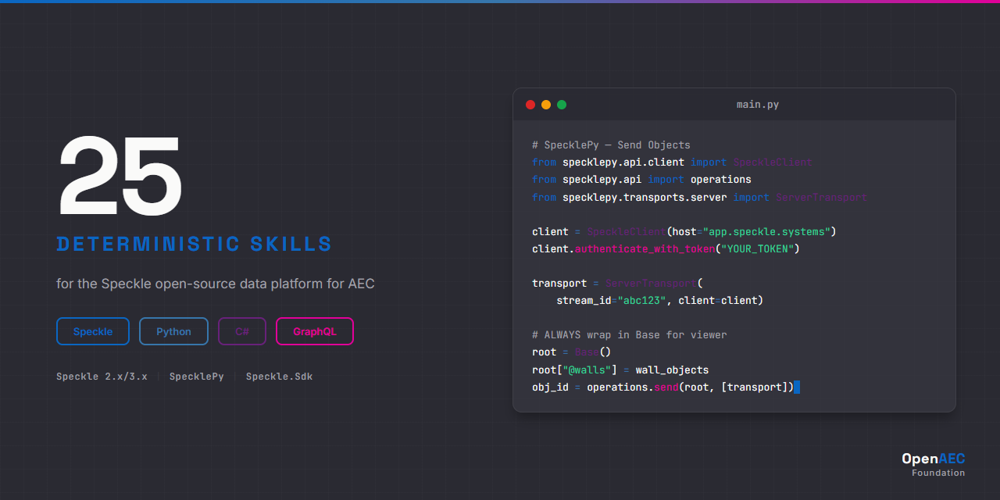

# Speckle Data Platform — Claude Skill Package

<p align="center">
  
</p>


**25 deterministic Claude AI skills for Speckle Data Platform — the open-source data infrastructure for AEC (Architecture, Engineering, Construction). Covers the full Speckle ecosystem: object model, GraphQL API, Python and C# SDKs, connectors (Revit, Rhino, Grasshopper, Blender, AutoCAD, Tekla), viewer, Automate, and data federation.**

Built on the [Agent Skills](https://agentskills.org) open standard.

---

## Why This Exists

Without skills, Claude lacks context about Speckle's transport architecture, detached object references, and connector-specific patterns:

```python
# Wrong — sends flat list without Base wrapper, breaks viewer
operations.send(wall_objects, [transport])
```

With this skill package, Claude produces correct Speckle patterns:

```python
# Correct — wraps in Base with detached "@" prefix for viewer compatibility
root = Base()
root["@walls"] = wall_objects
obj_id = operations.send(root, [transport])
```

---

## What's Inside

| Category | Count | Purpose |
|----------|:-----:|---------|
| **core/** | 3 | Object model, transport system, API fundamentals |
| **syntax/** | 4 | Base objects, GraphQL queries, webhooks, Automate syntax |
| **impl/** | 13 | SDK implementations, connectors, viewer, federation, versioning |
| **errors/** | 3 | Transport errors, conversion errors, authentication errors |
| **agents/** | 2 | Data validator, model coordinator |
| **Total** | **25** | |

## Skill Catalog

### Core (3 skills)

| Skill | Description |
|-------|-------------|
| `speckle-core-object-model` | Speckle's Base object, hashing, detached properties, dynamic members |
| `speckle-core-transport` | Transport architecture: ServerTransport, SQLiteTransport, MemoryTransport |
| `speckle-core-api` | REST and GraphQL API fundamentals, authentication, rate limits |

### Syntax (4 skills)

| Skill | Description |
|-------|-------------|
| `speckle-syntax-base-objects` | Creating and composing Base objects, property conventions, serialization |
| `speckle-syntax-graphql` | GraphQL query patterns for streams, commits, branches, objects |
| `speckle-syntax-webhooks` | Webhook configuration, payload structure, event types, retry logic |
| `speckle-syntax-automate` | Automate function syntax, triggers, inputs schema, result reporting |

### Implementation (13 skills)

| Skill | Description |
|-------|-------------|
| `speckle-impl-python-sdk` | SpecklePy: client setup, send/receive, operations, subscriptions |
| `speckle-impl-sharp-sdk` | Speckle.Sdk (C#): client, transports, serialization, .NET integration |
| `speckle-impl-connectors-overview` | Connector architecture, mapping strategy, shared patterns across all connectors |
| `speckle-impl-revit` | Revit connector: element mapping, family handling, parameter conversion |
| `speckle-impl-rhino-grasshopper` | Rhino and Grasshopper connectors: geometry conversion, component usage |
| `speckle-impl-blender` | Blender connector: mesh/curve conversion, collections, custom properties |
| `speckle-impl-autocad-civil3d` | AutoCAD and Civil3D connectors: entity mapping, alignment handling |
| `speckle-impl-tekla` | Tekla Structures connector: model object mapping, reinforcement, assemblies |
| `speckle-impl-powerbi` | Power BI connector: data extraction, stream queries, dashboard integration |
| `speckle-impl-viewer` | @speckle/viewer: embedding, filtering, coloring, extensions, interactions |
| `speckle-impl-automate-functions` | Building Automate functions: project structure, testing, deployment |
| `speckle-impl-federation` | Cross-model data federation: multi-stream coordination, object references |
| `speckle-impl-versioning` | Version management: commits, branches, diffing, history traversal |

### Errors (3 skills)

| Skill | Description |
|-------|-------------|
| `speckle-errors-transport` | Diagnosing transport failures: timeouts, network errors, object size limits |
| `speckle-errors-conversion` | Conversion error patterns: geometry loss, unsupported types, fallback strategies |
| `speckle-errors-auth` | Authentication and authorization errors: token expiry, scope issues, server config |

### Agents (2 skills)

| Skill | Description |
|-------|-------------|
| `speckle-agents-data-validator` | Validates Speckle data integrity: schema checks, reference resolution, property completeness |
| `speckle-agents-model-coordinator` | Orchestrates multi-model workflows: cross-discipline coordination, clash detection setup |

## Installation

### Claude Code

```bash
# Option 1: Clone the full package
git clone https://github.com/OpenAEC-Foundation/Speckle-Claude-Skill-Package.git
cp -r Speckle-Claude-Skill-Package/skills/source/ ~/.claude/skills/speckle/

# Option 2: Add as git submodule
git submodule add https://github.com/OpenAEC-Foundation/Speckle-Claude-Skill-Package.git .claude/skills/speckle
```

### Claude.ai (Web)

Upload individual SKILL.md files as project knowledge.

## Quick Start

After installation, skills activate automatically based on context:

- **Send data to Speckle** — ask Claude to send objects to a stream -> activates `speckle-impl-python-sdk` + `speckle-core-transport`
- **Query the API** — write a GraphQL query -> activates `speckle-syntax-graphql` + `speckle-core-api`
- **Build an Automate function** — create a Speckle Automate function -> activates `speckle-impl-automate-functions` + `speckle-syntax-automate`
- **Debug auth errors** — paste a 401/403 error -> activates `speckle-errors-auth`
- **Federate models** — coordinate data across streams -> activates `speckle-impl-federation` + `speckle-agents-model-coordinator`

## Technology Coverage

| Technology | Versions | Notes |
|------------|----------|-------|
| Speckle Server | **2.x / 3.x** | Primary target, both self-hosted and app.speckle.systems |
| SpecklePy | latest | Python SDK |
| Speckle.Sdk | latest | C# / .NET SDK |
| @speckle/viewer | latest | Web viewer component |
| Speckle Automate | latest | Serverless automation platform |
| Connectors | latest | Revit, Rhino, Grasshopper, Blender, AutoCAD, Civil3D, Tekla, Power BI |

## Contributing

Contributions are welcome. Each skill must meet the quality bar:

1. SKILL.md under 500 lines
2. YAML frontmatter with `name` (kebab-case, max 64 chars) and `description` (folded block scalar)
3. English-only content
4. Deterministic language (ALWAYS/NEVER, no "might", "consider", "often")
5. Verified against official Speckle documentation
6. Complete `references/` directory (methods.md, examples.md, anti-patterns.md)

See [WAY_OF_WORK.md](WAY_OF_WORK.md) for the full methodology and [REQUIREMENTS.md](REQUIREMENTS.md) for quality guarantees.

## Documentation

| Document | Purpose |
|----------|---------|
| [INDEX.md](INDEX.md) | Complete skill catalog with trigger scenarios |
| [ROADMAP.md](ROADMAP.md) | Project status (single source of truth) |
| [REQUIREMENTS.md](REQUIREMENTS.md) | Quality guarantees and per-area requirements |
| [DECISIONS.md](DECISIONS.md) | Architectural decisions with rationale |
| [SOURCES.md](SOURCES.md) | Official reference URLs and verification rules |
| [WAY_OF_WORK.md](WAY_OF_WORK.md) | 7-phase development methodology |
| [LESSONS.md](LESSONS.md) | Lessons learned during development |
| [CHANGELOG.md](CHANGELOG.md) | Version history |

## Related Skill Packages

| Package | Skills | Technology |
|---------|:------:|------------|
| [Blender-Bonsai](https://github.com/OpenAEC-Foundation/Blender-Bonsai-ifcOpenshell-Sverchok-Claude-Skill-Package) | 73 | Blender, Bonsai, IfcOpenShell, Sverchok |
| [ERPNext](https://github.com/OpenAEC-Foundation/ERPNext_Anthropic_Claude_Development_Skill_Package) | 28 | ERPNext / Frappe |
| [Tauri 2](https://github.com/OpenAEC-Foundation/Tauri-2-Claude-Skill-Package) | 27 | Tauri 2 / Rust / TypeScript |
| [Nextcloud](https://github.com/OpenAEC-Foundation/Nextcloud-Claude-Skill-Package) | 24 | Nextcloud |
| [React](https://github.com/OpenAEC-Foundation/React-Claude-Skill-Package) | 24 | React |
| [Vite](https://github.com/OpenAEC-Foundation/Vite-Claude-Skill-Package) | 22 | Vite |
| [n8n](https://github.com/OpenAEC-Foundation/n8n-Claude-Skill-Package) | 21 | n8n workflow automation |
| [pdf-lib](https://github.com/OpenAEC-Foundation/pdf-lib-Claude-Skill-Package) | 17 | pdf-lib |
| [PDFjs](https://github.com/OpenAEC-Foundation/PDFjs-Claude-Skill-Package) | 13 | pdfjs-dist |
| [Fluent-i18n](https://github.com/OpenAEC-Foundation/Fluent-i18n-Claude-Skill-Package) | 16 | Project Fluent i18n |

All packages at [OpenAEC Foundation](https://github.com/OpenAEC-Foundation).

## License

[MIT](LICENSE)

---

Built with the [7-phase research-first methodology](https://github.com/OpenAEC-Foundation/Skill-Package-Workflow-Template) by the [OpenAEC Foundation](https://github.com/OpenAEC-Foundation).
